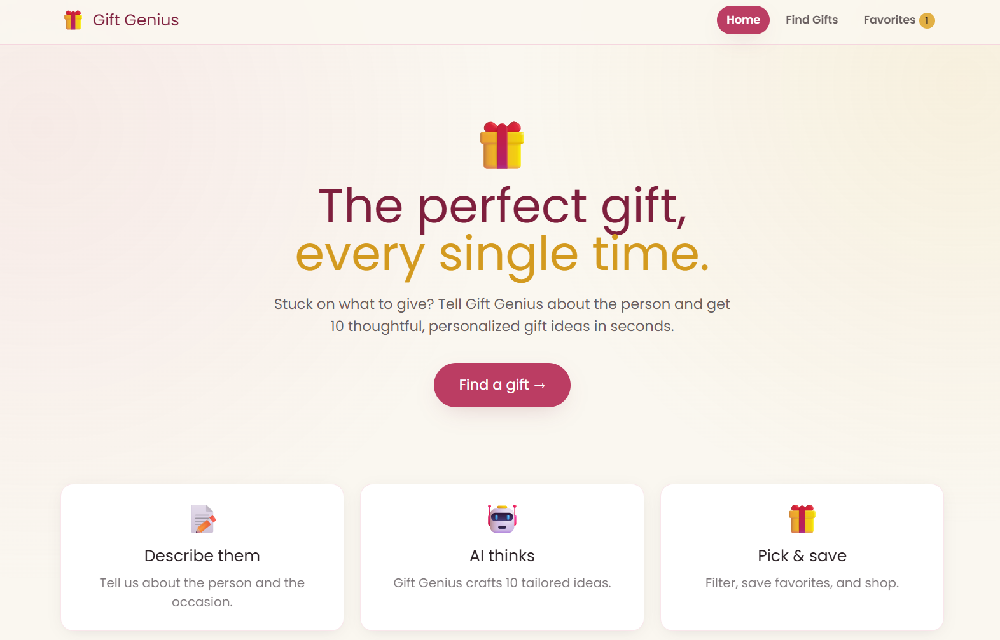
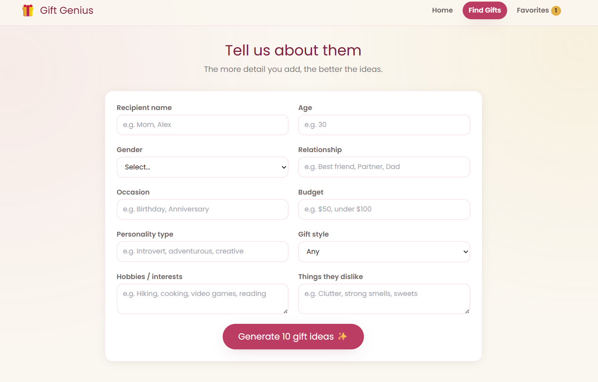
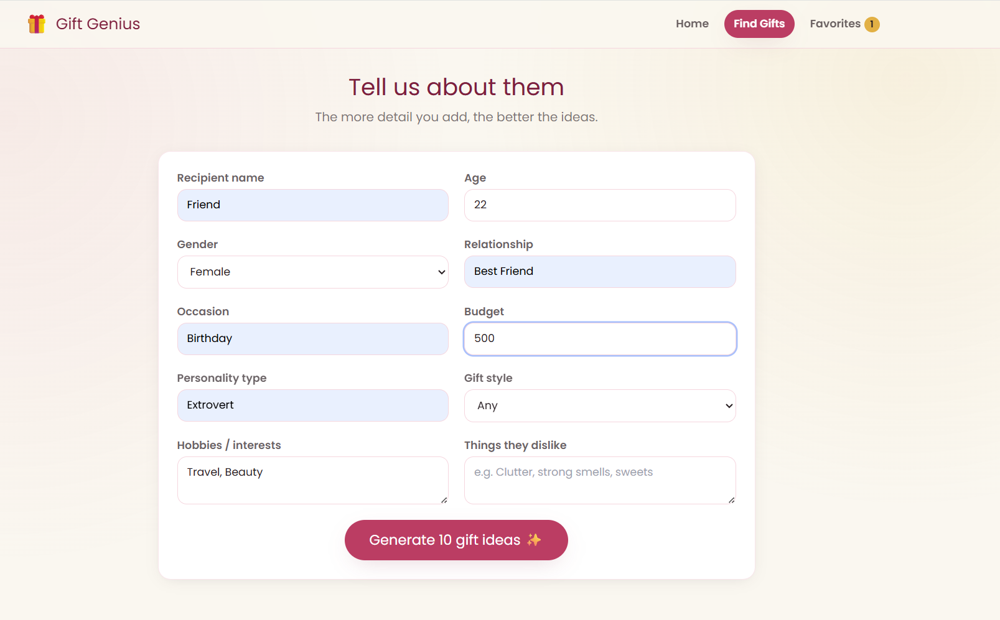
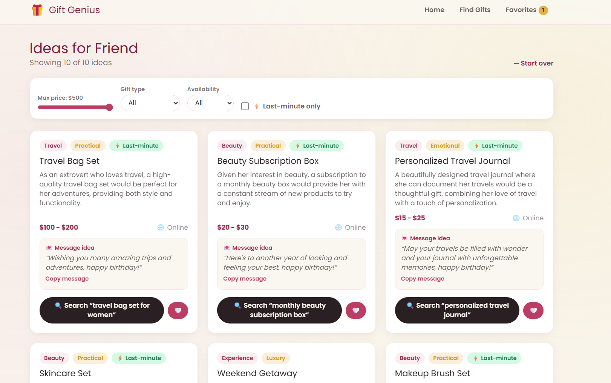
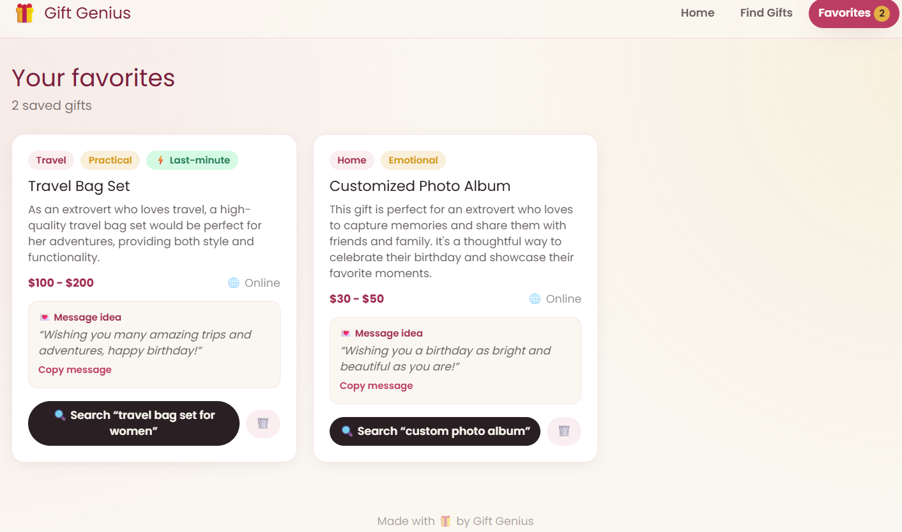

# 🎁 Gift Genius

> An AI-powered gift idea generator that turns "I have no idea what to get them" into 10 thoughtful, personalized suggestions in seconds.

### 🔗 [**Try it live → gift-genius-woad.vercel.app**](https://gift-genius-woad.vercel.app)

> ⏳ Note: the first load may take ~50 seconds while the free server wakes up — after that it's fast!

---

## What it does

Stuck on what to gift someone? Just describe the person — their age, hobbies, personality, budget, occasion, and even things they dislike — and Gift Genius uses AI to generate **10 tailored gift ideas**.

Each idea comes with:
- 🎁 A specific gift name
- 💡 Why it fits *that* person
- 💲 An estimated price range
- 🏷️ A category
- 🔍 A one-click Amazon search link
- 💌 A personal message idea for the card

You can filter the results by budget, gift type, and availability, and save your favorites for later.

---

## Screenshot

---

## Tech Stack

| Layer | Technology |
|-------|-----------|
| **Frontend** | React + Vite + Tailwind CSS |
| **Backend** | Node.js + Express |
| **Database** | MongoDB (Atlas) |
| **Hosting** | Vercel (frontend) · Render (backend) |

---

## Features

- Detailed input form (personality, hobbies, budget, occasion, dislikes, gift style)
- 10 AI-generated, personalized gift ideas per request
- Filters: budget range, gift type, online/in-store, last-minute
- Save & manage favorite gift ideas
- Clean, responsive design that works on phone and desktop

---

## About this project

This was my first time taking a full-stack app all the way from **idea → code → deployed and live** — wiring together a React frontend, an Express backend, a MongoDB database, and an AI provider, then deploying it across multiple platforms.

Built by **Heta Patel** — full-stack developer (React · Node.js).

> 🔒 The source code is kept in a private repository. This page is a public showcase — feel free to try the live app above!
